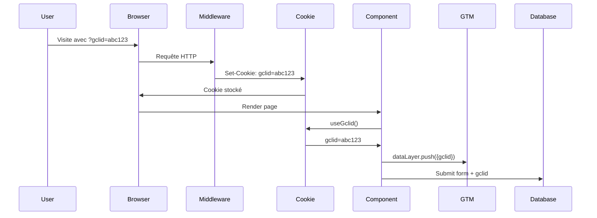

# 🎯 Système de Tracking GCLID - Documentation Complète

## 📋 Vue d'ensemble

Ce système capture automatiquement le paramètre `gclid` (Google Click ID) des URL et le stocke dans un cookie partagé entre tous les sous-domaines de `mynotary.io`. Cela permet de suivre les conversions provenant de Google Ads sur l'ensemble du site et de ses sous-domaines.

## ✅ Fonctionnalités Implémentées

- ✅ Capture automatique du paramètre `gclid` dans l'URL
- ✅ Stockage dans un cookie partagé entre sous-domaines (`.mynotary.io`)
- ✅ Durée de vie de 90 jours (standard Google Ads)
- ✅ Cookie sécurisé (HTTPS uniquement, SameSite=Lax)
- ✅ Utilitaires JavaScript pour accéder au gclid
- ✅ Hook React personnalisé (`useGclid`)
- ✅ Composant de tracking automatique avec GTM
- ✅ Documentation complète et exemples

## 📁 Fichiers Créés/Modifiés

### Fichiers d'implémentation
1. **`middleware.js`** - Middleware Next.js qui capture le gclid et crée le cookie
2. **`src/utils/cookies.js`** - Utilitaires pour manipuler les cookies (getCookie, getGclid, setCookie)
3. **`src/hooks/useGclid.js`** - Hook React personnalisé pour utiliser le gclid dans les composants
4. **`src/components/GclidTracker.jsx`** - Composant qui track automatiquement et envoie à GTM
5. **`src/components/Providers.jsx`** - Modifié pour inclure le GclidTracker

### Fichiers de documentation
6. **`GCLID_TRACKING.md`** - Documentation technique du système
7. **`GCLID_USAGE_EXAMPLES.md`** - Exemples d'utilisation dans différents contextes
8. **`GCLID_TEST_GUIDE.md`** - Guide complet pour tester l'implémentation
9. **`GCLID_DATABASE_SCHEMA.md`** - Schéma de base de données recommandé
10. **`GCLID_README.md`** - Ce fichier (vue d'ensemble)

## 🚀 Installation et Configuration

### 1. Vérification

Tous les fichiers ont déjà été créés et intégrés dans votre projet. Aucune installation supplémentaire n'est nécessaire.

### 2. Configuration du domaine

Le cookie est configuré pour le domaine `.mynotary.io`. Si vous utilisez un autre domaine, modifiez :

**Dans `middleware.js`** :
```javascript
'Domain=.mynotary.io', // Changez ici
```

**Dans `src/utils/cookies.js`** :
```javascript
export function setCookie(name, value, days = 90, domain = '.mynotary.io') {
  // Changez ici
}
```

**Dans `src/hooks/useGclid.js`** :
```javascript
setCookie('gclid', gclidValue, 90, '.mynotary.io') // Changez ici
```

## 📖 Utilisation Rapide

### 1. Utilisation basique (récupérer le gclid)

```javascript
import { getGclid } from '@/utils/cookies'

const gclid = getGclid()
console.log('GCLID actuel:', gclid)
```

### 2. Utilisation dans un composant React

```javascript
'use client'
import { useGclid } from '@/hooks/useGclid'

export default function MyComponent() {
  const gclid = useGclid()
  
  return (
    <div>
      {gclid && <p>Utilisateur vient de Google Ads: {gclid}</p>}
    </div>
  )
}
```

### 3. Envoi avec un formulaire

```javascript
import { getGclid } from '@/utils/cookies'

async function handleSubmit(formData) {
  const data = {
    ...formData,
    gclid: getGclid() // Ajouter le gclid
  }
  
  await fetch('/api/submit', {
    method: 'POST',
    body: JSON.stringify(data)
  })
}
```

## 🧪 Test de l'Implémentation

### Test rapide

1. Démarrer le serveur :
   ```bash
   npm run dev
   ```

2. Visiter avec un gclid :
   ```
   http://localhost:3000/?gclid=test123
   ```

3. Ouvrir DevTools (F12) → Application → Cookies
4. Vérifier que le cookie `gclid` existe avec la valeur `test123`

Pour plus de tests, voir **`GCLID_TEST_GUIDE.md`**

## 📊 Intégration avec Google Tag Manager

Le composant `GclidTracker` envoie automatiquement un événement à GTM :

```javascript
window.dataLayer.push({
  event: 'gclid_captured',
  gclid: 'valeur_du_gclid',
  timestamp: '2024-01-01T00:00:00.000Z'
})
```

### Configuration dans GTM

1. Créer une variable "Data Layer Variable" nommée `gclid`
2. Créer un déclencheur sur l'événement `gclid_captured`
3. Créer des balises de conversion qui utilisent cette variable

## 💾 Stockage en Base de Données

Pour stocker le gclid dans votre base de données, voir **`GCLID_DATABASE_SCHEMA.md`**

Exemple rapide avec Supabase :

```javascript
import { createClientComponentClient } from '@supabase/auth-helpers-nextjs'
import { getGclid } from '@/utils/cookies'

const supabase = createClientComponentClient()
const gclid = getGclid()

await supabase.from('bookings').insert({
  name: 'John Doe',
  email: 'john@example.com',
  gclid: gclid // Stocker le gclid
})
```

## 🔒 Sécurité et Conformité

### Caractéristiques du Cookie

- **Secure** : ✅ Uniquement HTTPS
- **SameSite** : ✅ Lax (protection CSRF)
- **HttpOnly** : ❌ Non (doit être accessible par JavaScript)
- **Domain** : ✅ `.mynotary.io` (partagé entre sous-domaines)
- **Max-Age** : ✅ 90 jours (7,776,000 secondes)

### RGPD

⚠️ **Important** : Le GCLID est considéré comme une donnée de tracking. Vous devez :

1. Mentionner ce cookie dans votre politique de confidentialité
2. Obtenir le consentement des utilisateurs (si applicable dans votre juridiction)
3. Permettre aux utilisateurs de refuser/supprimer le cookie

La politique de confidentialité (`app/privacy-policy/page.jsx`) mentionne déjà les cookies de tracking Google Tag Manager.

## 📚 Documentation Complète

Pour plus d'informations, consultez :

- **[GCLID_TRACKING.md](./GCLID_TRACKING.md)** - Fonctionnement technique détaillé
- **[GCLID_USAGE_EXAMPLES.md](./GCLID_USAGE_EXAMPLES.md)** - 7 exemples d'utilisation complets
- **[GCLID_TEST_GUIDE.md](./GCLID_TEST_GUIDE.md)** - Guide de test approfondi
- **[GCLID_DATABASE_SCHEMA.md](./GCLID_DATABASE_SCHEMA.md)** - Schémas de base de données

## 🐛 Dépannage

### Le cookie n'est pas créé

- Vérifiez que l'URL contient bien `?gclid=...`
- Vérifiez que le middleware Next.js fonctionne
- Regardez la console du navigateur pour les erreurs

### Le cookie n'est pas partagé entre sous-domaines

- En développement local (`localhost`), le partage ne fonctionne pas
- En production, vérifiez que le domaine est bien `.mynotary.io`
- Vérifiez que tous les sous-domaines utilisent HTTPS

### Le hook `useGclid` retourne `null`

- Vérifiez que le composant utilise `'use client'`
- Vérifiez que `GclidTracker` est bien dans `Providers.jsx`
- Ouvrez les DevTools pour voir les logs en développement

## 📈 Workflow Complet



## ✨ Fonctionnalités Avancées

### Tracking de conversions automatique

Le `GclidTracker` est déjà intégré et envoie automatiquement les données à GTM.

### Personnalisation de l'expérience utilisateur

```javascript
const gclid = useGclid()

if (gclid) {
  // Utilisateur vient de Google Ads
  // Afficher une offre spéciale, un message personnalisé, etc.
}
```

### Analytics et Reporting

Créez des requêtes SQL pour analyser vos conversions (voir `GCLID_DATABASE_SCHEMA.md`)

## 🤝 Support

Pour toute question ou problème :

1. Consultez d'abord la documentation complète
2. Vérifiez la section Dépannage
3. Utilisez le guide de test pour valider l'implémentation
4. Consultez les exemples d'utilisation

## 📝 Changelog

### Version 1.0.0 (Date actuelle)
- ✅ Implémentation initiale complète
- ✅ Middleware Next.js pour capture automatique
- ✅ Utilitaires et hooks React
- ✅ Composant de tracking GTM
- ✅ Documentation complète
- ✅ Exemples d'utilisation
- ✅ Guide de test
- ✅ Schéma de base de données

## 📄 Licence

Ce code fait partie de votre projet et suit la même licence.

---

**🎉 Le système est prêt à l'emploi !**

Commencez par tester avec `?gclid=test` dans votre URL pour vérifier que tout fonctionne correctement.


